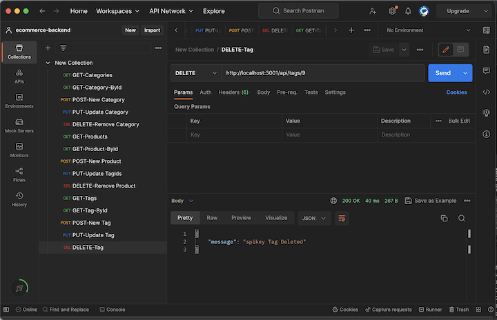

# E-Commerce Back End

## Description
This is the backend for an eCommerce website. It is comprised of 4 main tables: category, product, tag and product_tag. Each containing useful information about the products being sold. The data can be access and updated via API routes.

## Table of Contents
- [Usage](#usage)
- [Credits](#credits)
- [Features](#features)
- [Access](#access)

## Usage
- The server can be launched with the following command
```bash
node server.js
```
- The APIs can be tested in Postman




## Credits
This application used starter code which can be found [here](https://github.com/coding-boot-camp/fantastic-umbrella). 

## Features
- Explore the database via APIs
- Easily update with new Categories, Products and Tags, creating new associations
- Use and enjoy!

## Access
[Click to View Repository](https://github.com/johnpow/ecommerce-backend)

[Click for Video Walkthrough](https://drive.google.com/file/d/1emJcB27Zmf8-_wYbaSzzA0aPtzMM6odn/view)
