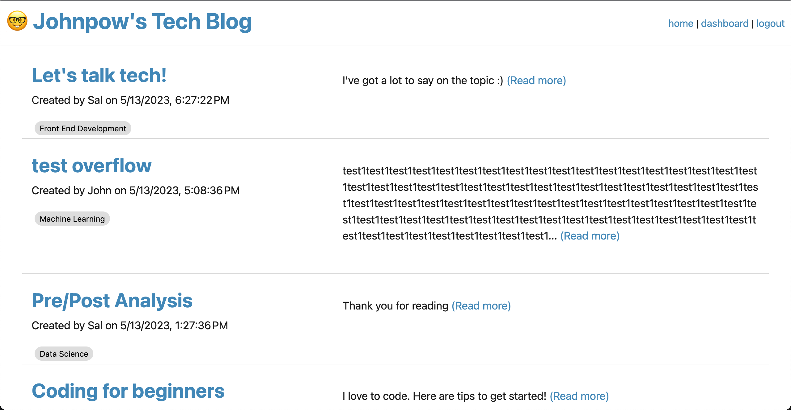

# Tech Blog

## Description
This is a tech blog for anyone who wants to come and discuss tech. You can view blog posts without an account, but if you want to get involed, you can create an account which allows you to comment on posts and create posts of your own.

## Table of Contents
- [Usage](#usage)
- [Credits](#credits)
- [Features](#features)
- [Access](#access)

## Usage
- The server can be launched with the following command
```bash
node server.js
```
- The blog can contain lots of interesting content




## Credits
This application is based on learning and code snippets from our MVC trainings. 

## Features
- Create and edit blog posts
- Comment on blog posts
- Create your own or multiple users
- Use and enjoy!

## Access
[Click to View Repository](https://github.com/johnpow/tech-blog)

[Click for Deployed Heroku Link](https://johnpow-tech-blog.herokuapp.com/)
